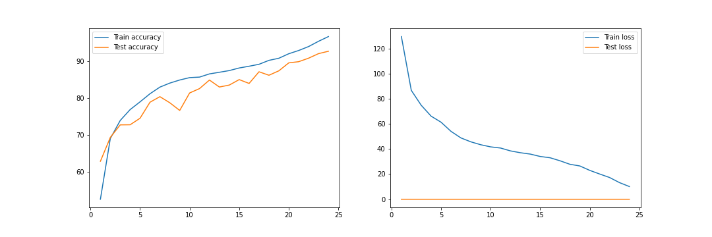
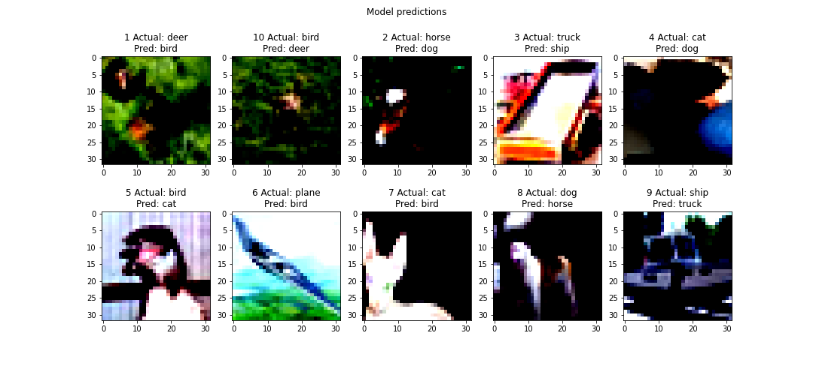

## Requirement
- Write a custom ResNet architecture for CIFAR10 dataset using:
  - Batch size = 512
  - Optimizer = Adam
  - Criterion = Cross entropy loss
- Use one cycle policy with:
  - Total epochs = 24
  - Max at epoch = 5
  - LR min and LR max to be found out using LRFinder
  - No annihilation
- Use albumentation library and apply below augmentation techniques:
  - RandomCrop = 32, 32 with padding of 4
  - HorizontalFlip
  - CoarseDropout = 8, 8
- Achieve 90% test accuracy

## Code Walkthrough
- `S10.ipynb` is a notebook file that contains all experiments.
- `models/custom_resnet.py` contains custom ResNet model architecture that inherits `model_composite` class. `model_composite` contains common code for model training and evaluation.
- `utils` directory contain modules for fetching dataset, scheduler, applying data transformations, and utility code for visualizations etc.

## Experiment Results
#### TARGET:
    - Build a custom ResNet model based on David C. Page model, DAWNBench challenge.
#### RESULT:
    - Parameters: 6,573,120
    - Best training accuracy: 90.74%
    - Best testing accuracy: 90.15%
#### ANALYSIS:
    - The gap between train and test accuracies are very low which is indeed a good sign as the model is generalizable.
    - Using the ResNet kind architecture, LRFinder, and OneCycleLR, a testing accuracy of 90% is achieved.


#### MODEL ARCHITECTURE:
[The final model code snippet](./models/custom_resnet.py)

```
----------------------------------------------------------------
        Layer (type)               Output Shape         Param #
================================================================
            Conv2d-1           [-1, 64, 32, 32]           1,728
       BatchNorm2d-2           [-1, 64, 32, 32]             128
              ReLU-3           [-1, 64, 32, 32]               0
            Conv2d-4          [-1, 128, 32, 32]          73,728
         MaxPool2d-5          [-1, 128, 16, 16]               0
       BatchNorm2d-6          [-1, 128, 16, 16]             256
              ReLU-7          [-1, 128, 16, 16]               0
            Conv2d-8          [-1, 128, 16, 16]         147,456
       BatchNorm2d-9          [-1, 128, 16, 16]             256
             ReLU-10          [-1, 128, 16, 16]               0
           Conv2d-11          [-1, 128, 16, 16]         147,456
      BatchNorm2d-12          [-1, 128, 16, 16]             256
             ReLU-13          [-1, 128, 16, 16]               0
           Conv2d-14          [-1, 256, 16, 16]         294,912
        MaxPool2d-15            [-1, 256, 8, 8]               0
      BatchNorm2d-16            [-1, 256, 8, 8]             512
             ReLU-17            [-1, 256, 8, 8]               0
           Conv2d-18            [-1, 512, 8, 8]       1,179,648
        MaxPool2d-19            [-1, 512, 4, 4]               0
      BatchNorm2d-20            [-1, 512, 4, 4]           1,024
             ReLU-21            [-1, 512, 4, 4]               0
           Conv2d-22            [-1, 512, 4, 4]       2,359,296
      BatchNorm2d-23            [-1, 512, 4, 4]           1,024
             ReLU-24            [-1, 512, 4, 4]               0
           Conv2d-25            [-1, 512, 4, 4]       2,359,296
      BatchNorm2d-26            [-1, 512, 4, 4]           1,024
             ReLU-27            [-1, 512, 4, 4]               0
        MaxPool2d-28            [-1, 512, 1, 1]               0
          Flatten-29                  [-1, 512]               0
           Linear-30                   [-1, 10]           5,120
================================================================
Total params: 6,573,120
Trainable params: 6,573,120
Non-trainable params: 0
----------------------------------------------------------------
Input size (MB): 0.01
Forward/backward pass size (MB): 6.45
Params size (MB): 25.07
Estimated Total Size (MB): 31.53
----------------------------------------------------------------
```

#### VISUALIZATIONS:  
- Accuracy and loss plots  
The test accuracy is higher than the train accuracy because of the regularization techniques. The model is capable enough to learn and pass on the learnings across epochs.  

  

- Incorrect predictions
  