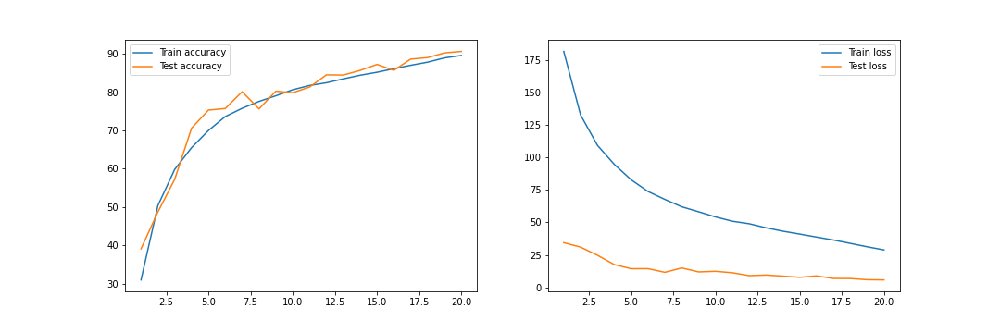
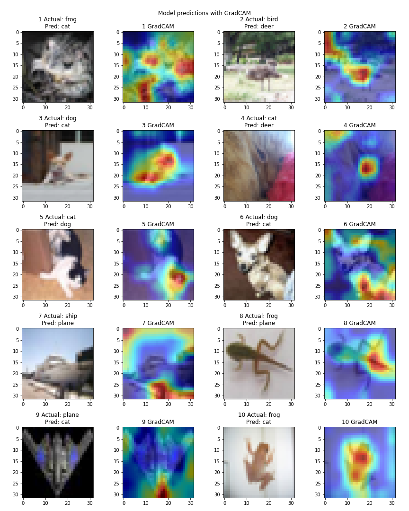

## Requirement
- Train ResNet18 for 20 epochs on the CIFAR10 dataset
- Show loss curves for test and train datasets
- Show a gallery of 10 misclassified images
- Show GradCAM output on 10 misclassified images
- Apply these transforms while training:
    - RandomCrop(32, padding=4)
    - CutOut(16x16)

## Code Walkthrough
- `S11.ipynb` is a notebook file that contains all experiments.
- `main.py` is a main script file that performs end-to-end operations.
- `models/model_composite.py` contains common code for model training and evaluation.
- `utils` directory contain modules for fetching dataset, scheduler, applying data transformations, and utility code for visualizations etc.

## Experiment Results
#### TARGET:
    - Build a ResNet18 model on CIFAR10 dataset
    - Achieve a min of 85% test accuracy
#### RESULT:
    - Parameters: 11,173,962
    - Best training accuracy: 89.59%
    - Best testing accuracy: 90.65%

#### MODEL ARCHITECTURE:

```
==========================================================================================
Layer (type:depth-idx)                   Output Shape              Param #
==========================================================================================
ResNet                                   [512, 10]                 --
├─Conv2d: 1-1                            [512, 64, 32, 32]         1,728
├─BatchNorm2d: 1-2                       [512, 64, 32, 32]         128
├─Sequential: 1-3                        [512, 64, 32, 32]         --
│    └─BasicBlock: 2-1                   [512, 64, 32, 32]         --
│    │    └─Conv2d: 3-1                  [512, 64, 32, 32]         36,864
│    │    └─BatchNorm2d: 3-2             [512, 64, 32, 32]         128
│    │    └─Conv2d: 3-3                  [512, 64, 32, 32]         36,864
│    │    └─BatchNorm2d: 3-4             [512, 64, 32, 32]         128
│    │    └─Sequential: 3-5              [512, 64, 32, 32]         --
│    └─BasicBlock: 2-2                   [512, 64, 32, 32]         --
│    │    └─Conv2d: 3-6                  [512, 64, 32, 32]         36,864
│    │    └─BatchNorm2d: 3-7             [512, 64, 32, 32]         128
│    │    └─Conv2d: 3-8                  [512, 64, 32, 32]         36,864
│    │    └─BatchNorm2d: 3-9             [512, 64, 32, 32]         128
│    │    └─Sequential: 3-10             [512, 64, 32, 32]         --
├─Sequential: 1-4                        [512, 128, 16, 16]        --
│    └─BasicBlock: 2-3                   [512, 128, 16, 16]        --
│    │    └─Conv2d: 3-11                 [512, 128, 16, 16]        73,728
│    │    └─BatchNorm2d: 3-12            [512, 128, 16, 16]        256
│    │    └─Conv2d: 3-13                 [512, 128, 16, 16]        147,456
│    │    └─BatchNorm2d: 3-14            [512, 128, 16, 16]        256
│    │    └─Sequential: 3-15             [512, 128, 16, 16]        8,448
│    └─BasicBlock: 2-4                   [512, 128, 16, 16]        --
│    │    └─Conv2d: 3-16                 [512, 128, 16, 16]        147,456
│    │    └─BatchNorm2d: 3-17            [512, 128, 16, 16]        256
│    │    └─Conv2d: 3-18                 [512, 128, 16, 16]        147,456
│    │    └─BatchNorm2d: 3-19            [512, 128, 16, 16]        256
│    │    └─Sequential: 3-20             [512, 128, 16, 16]        --
├─Sequential: 1-5                        [512, 256, 8, 8]          --
│    └─BasicBlock: 2-5                   [512, 256, 8, 8]          --
│    │    └─Conv2d: 3-21                 [512, 256, 8, 8]          294,912
│    │    └─BatchNorm2d: 3-22            [512, 256, 8, 8]          512
│    │    └─Conv2d: 3-23                 [512, 256, 8, 8]          589,824
│    │    └─BatchNorm2d: 3-24            [512, 256, 8, 8]          512
│    │    └─Sequential: 3-25             [512, 256, 8, 8]          33,280
│    └─BasicBlock: 2-6                   [512, 256, 8, 8]          --
│    │    └─Conv2d: 3-26                 [512, 256, 8, 8]          589,824
│    │    └─BatchNorm2d: 3-27            [512, 256, 8, 8]          512
│    │    └─Conv2d: 3-28                 [512, 256, 8, 8]          589,824
│    │    └─BatchNorm2d: 3-29            [512, 256, 8, 8]          512
│    │    └─Sequential: 3-30             [512, 256, 8, 8]          --
├─Sequential: 1-6                        [512, 512, 4, 4]          --
│    └─BasicBlock: 2-7                   [512, 512, 4, 4]          --
│    │    └─Conv2d: 3-31                 [512, 512, 4, 4]          1,179,648
│    │    └─BatchNorm2d: 3-32            [512, 512, 4, 4]          1,024
│    │    └─Conv2d: 3-33                 [512, 512, 4, 4]          2,359,296
│    │    └─BatchNorm2d: 3-34            [512, 512, 4, 4]          1,024
│    │    └─Sequential: 3-35             [512, 512, 4, 4]          132,096
│    └─BasicBlock: 2-8                   [512, 512, 4, 4]          --
│    │    └─Conv2d: 3-36                 [512, 512, 4, 4]          2,359,296
│    │    └─BatchNorm2d: 3-37            [512, 512, 4, 4]          1,024
│    │    └─Conv2d: 3-38                 [512, 512, 4, 4]          2,359,296
│    │    └─BatchNorm2d: 3-39            [512, 512, 4, 4]          1,024
│    │    └─Sequential: 3-40             [512, 512, 4, 4]          --
├─Linear: 1-7                            [512, 10]                 5,130
==========================================================================================
Total params: 11,173,962
Trainable params: 11,173,962
Non-trainable params: 0
Total mult-adds (G): 284.38
==========================================================================================
Input size (MB): 6.29
Forward/backward pass size (MB): 5033.21
Params size (MB): 44.70
Estimated Total Size (MB): 5084.19
==========================================================================================
```

#### VISUALIZATIONS:  
- Accuracy and loss plots  

  

- Incorrect predictions and visualizations with GradCAM  
  