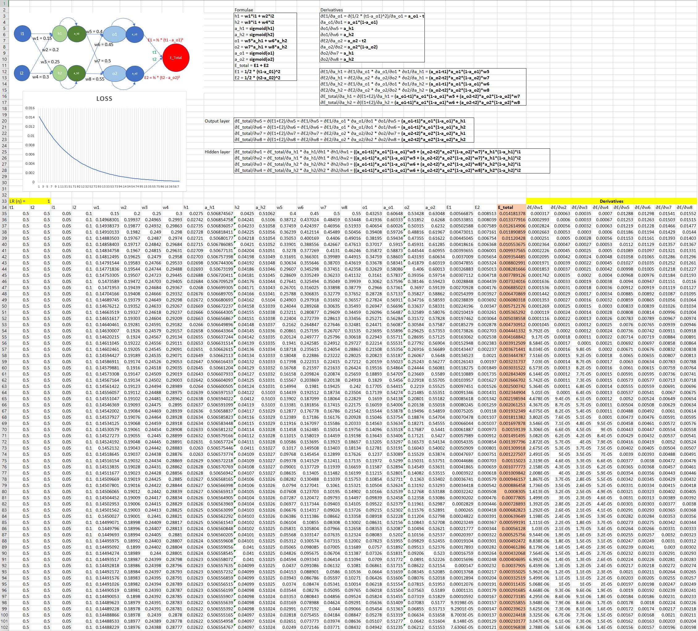

# PART 1
## Backpropagation  

The below image refers to the backpropagation calculated using excel. The [`backpropagation.xlsx`](./Backpropagation.xlsx) excel file contains the calculations.

### Steps to calculate gradients:
- The `Formulae` section refers to the forward pass. Here, the outputs are updated based on the inputs and weights. At last, the total loss is calculated.
- The `Output layer` and the `Hidden layer` blocks refer to the gradient calculation of the network loss w.r.t output and the hidden layer weights. This block provides the formulae for the gradient calculation.
- The `Derivatives` block contain helper derivatives to compute the final derivative for every weight.
- The `Derivatives` section (highlighted) in the table calculates the gradient for each weight in the network.
- Based on the gradient, the corresponding weights are updated.
- The total loss is calculated everytime after all the weights are updated. The calculations are performed ~100 times to reduce the loss which can also be noted from the plot.