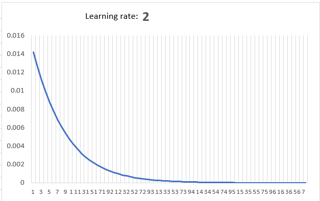
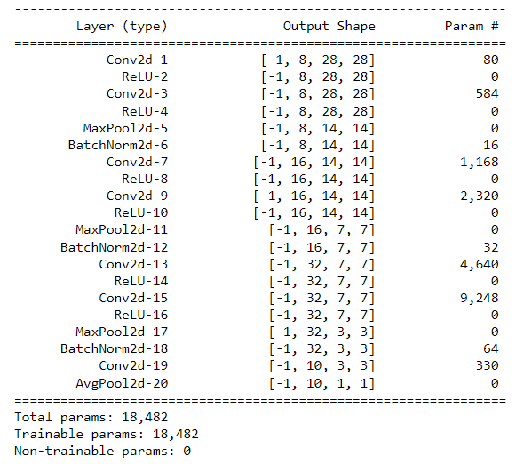
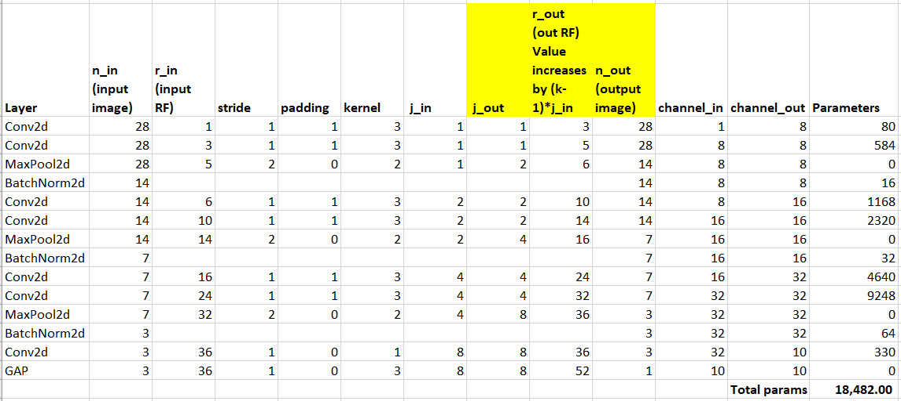

# PART 1
## Backpropagation  

The below image refers to the backpropagation calculated using excel. The [`backpropagation.xlsx`](./Backpropagation.xlsx) excel file contains the calculations.

### Steps to calculate gradients:
- The `Formulae` section refers to the forward pass. Here, the outputs are updated based on the inputs and weights. At last, the total loss is calculated.
- The `Output layer` and the `Hidden layer` blocks refer to the gradient calculation of the network loss w.r.t output and the hidden layer weights. This block provides the formulae for the gradient calculation.
- The `Derivatives` block contain helper derivatives to compute the final derivative for every weight.
- The `Derivatives` section (highlighted) in the table calculates the gradient for each weight in the network.
- Based on the gradient, the corresponding weights are updated.
- The total loss is calculated everytime after all the weights are updated. The calculations are performed ~100 times to reduce the loss which can also be noted from the plot.

### Visualise loss for different learning rates:
Learning rate: 0.1  

Learning rate: 0.2  

Learning rate: 0.5  

Learning rate: 0.8  

Learning rate: 1  

Learning rate: 2  

# PART 2
### Requirement:
Train a CNN model having less than 20K parameters. The network should be able to achieve 99.4% validation accuracy within 20 epochs.

### Solution Summary:  
Parameters: 18,482  
Validation accuracy: 99.46%  
Epoch: 6  
Used 1x1 convolution + GAP

### Model Architecture:  
The below image shows the CNN model architecture. The model consists of 3 blocks of convolution layers followed by 1x1 convolution + GAP layers. Each block consists of 2 conv2d layers with a padding set to 1 followed by max pooling and batch normalization.  
The model is able to achieve 99.46% validation accuracy at epoch 6.

### Receptive field calculation:
The below image shows the RF calculation. It can be noted that the RF achieved through the proposed network is **52** for an image size of 28x28.

 

The notebook can be found [here](./S6.ipynb).