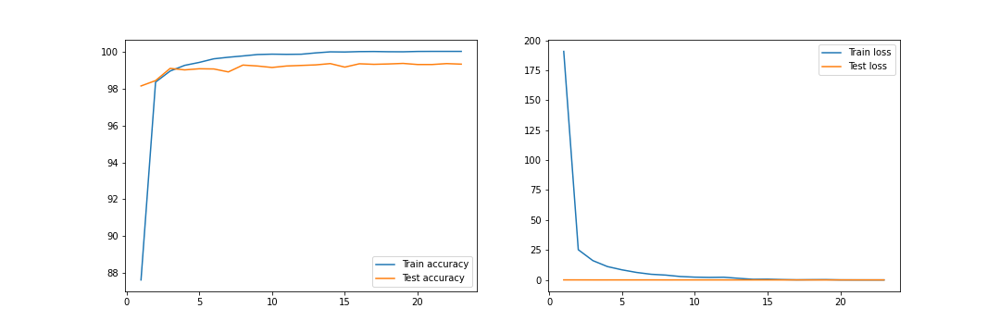
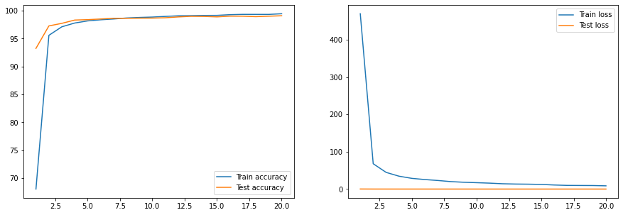
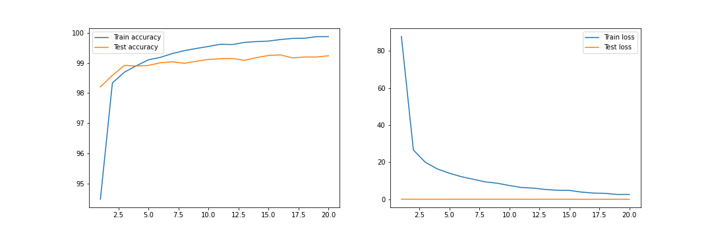
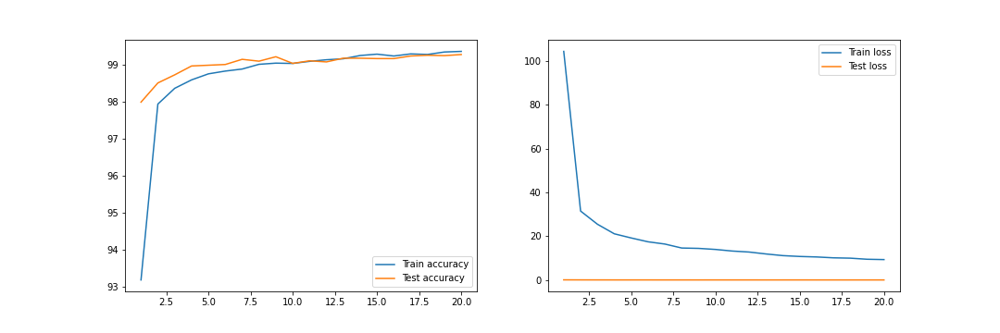
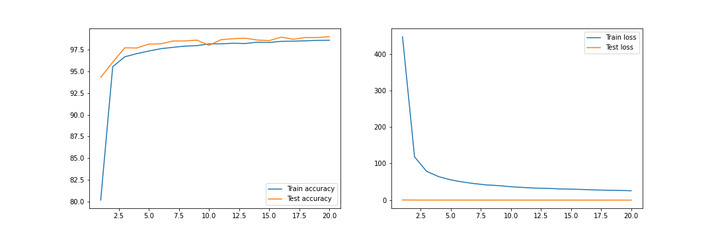
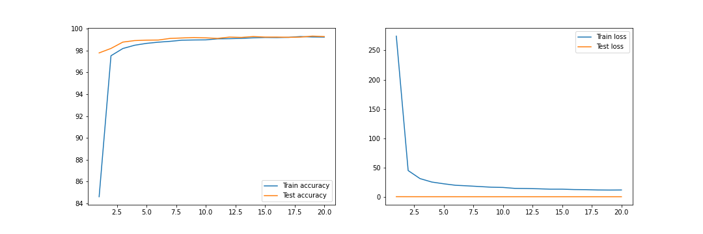
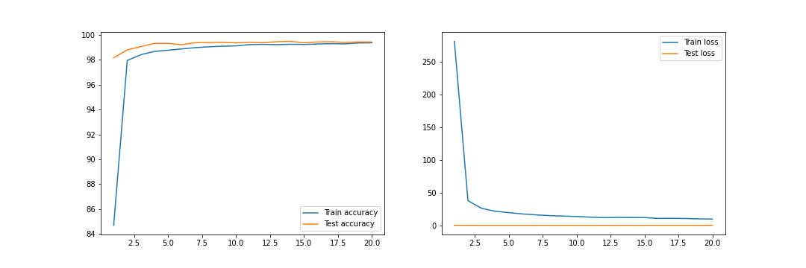

## Requirement
- The CNN model should achieve a minimum of 99.4% test accuracy.
- The model should achieve 99.4% test accuracy at least 2 times in 15 epochs.
- The model should be trained less than 15 epochs.
- The maximum number of parameters is 8k.  

## Experiments

### Model 1
#### TARGET:
  - Get the setup right
  - Set data transforms
  - Set data loaders
  - Set basic working code
  - Set basic training and testing loop  
#### RESULT:
  - Parameters: 6,379,786
  - Best training accuracy: 100%
  - Best testing accuracy: 99.35%
  

#### ANALYSIS:
  - Heavy model for MNIST dataset
  - Model is overfitting

### Model 2
#### TARGET:
    - Commit to model architecture
    - Calculate the RF at the end of each block
#### RESULT:
    - Parameters: 194,884
    - Best training accuracy: 99.45%
    - Best testing accuracy: 99.09%
  

#### ANALYSIS:
    - The model is still large for MNIST kind of data, but far better than the previous model
    - The gap between the test and train accuracy is very less compared to previous model

### Model 3
#### TARGET:
    - Reduce the number of parameters from the previous model without changing the skeleton
#### RESULT:
    - Parameters: 10,790
    - Best training accuracy: 99.21%
    - Best testing accuracy: 98.77%
  

#### ANALYSIS:
    - The model is far better than model 1 since the gap between training and testing accuracy is less with far less parameters.
    - Model is overfitting after 11 epochs

### Model 4
#### TARGET:
    - Add batch normalization to increase train and test accuracy
#### RESULT:
    - Parameters: 10,970
    - Best training accuracy: 99.88%
    - Best testing accuracy: 99.27%
  

#### ANALYSIS:
    - Improved accuracy compared to previous model
    - Model starts overfitting
    - The gap between train and test accuracy is increased
    - Model will not be able to achieve 99.4% accuracy

### Model 5
#### TARGET:
    - Add dropout to decrease the gap between train and test accuracy
    - Reduce overfitting
#### RESULT:
    - Parameters: 10,970
    - Best training accuracy: 99.37%
    - Best testing accuracy: 99.28%
  

#### ANALYSIS:
    - Certainly, the gap has been reduced between train and test accuracy
    - Model will not be able to reach 99.4% accuracy as it's oscillating at ~99.2%

### Model 6
#### TARGET:
    - Replace conv 7x7 by GAP
#### RESULT:
    - Parameters: 6,050
    - Best training accuracy: 98.59%
    - Best testing accuracy: 99%
  

#### ANALYSIS:
    - Because of the reduction in the number of parameters, the accuracy is reduced for both training and testing

### Model 7
#### TARGET:
    - Increase the number of parameters
#### RESULT:
    - Parameters: 11,994
    - Best training accuracy: 99.29%
    - Best testing accuracy: 99.33%
  

#### ANALYSIS:
    - The accuracy is oscillating around 99.2%
    - The model can never reach 99.4% accuracy

### Model 8
#### TARGET:
    - Add transition block when RF is 5
    - Distribute the weight across all the layers
#### RESULT:
    - Parameters: 13,828
    - Best training accuracy: 99.38%
    - Best testing accuracy: 99.49%
  

#### ANALYSIS:
    - The model is not over-fitting
    - The model reached 99.4% accuracy 5 times within 15 epochs but with 13k parameters