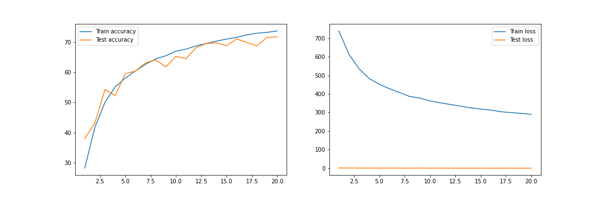

## Requirement
- The CNN model should achieve a minimum of 70% test accuracy for CIFAR10 dataset.
- The model should be trained less than 20 epochs.
- The maximum number of parameters is 50K.
- Add skip connections to the model architecture.
- Make 3 versions of the model based on the below normalization layers:
  - Batch Normalization
  - Layer Normalization
  - Group Normalization

## Code Walkthrough
- `S8.ipynb` is a notebook file that contains all experiments.
- `models` directory contains different model architectures that are experimented. All model architecture modules inherit `model_composite` class which contains common code for model training and evaluation.
- `utils` directory contain modules for fetching dataset, applying data transformations, and utility code for visualizations etc.
#### Final Model Architecture:
  - C1 C2 ***c3 P1*** C3 C4 C5 ***c6 P2*** C7 C8 C9 GAP ***c10***
  - c3 P1, c6 P2 and c10 are transition blocks

## Experiment Results
#### TARGET:
  - Add skip connections
  - Add batch, layer, and group normalization layers separately  
#### RESULT:
  - Parameters: 33,872
  - Batch normalization:
      - Best training accuracy: 78.12%
      - Best testing accuracy: 76.8%
  - Layer normalization:
      - Best training accuracy: 73.81%
      - Best testing accuracy: 71.83%
  - Group normalization:
      - Best training accuracy: 74.82%
      - Best testing accuracy: 73.82%  
#### ANALYSIS:
  - The model with batch normalization layers are having higher accuracy followed by group normalization and layer normalization.
  - The gap between train and test accuracy is less in group normalization.

#### VISUALIZATIONS:  
**Batch Normalization:**  
- Accuracy and loss plots
  
- Incorrect predictions
  

**Layer Normalization:**  
- Accuracy and loss plots
  
- Incorrect predictions
  

**Group Normalization:**  
- Accuracy and loss plots
  
- Incorrect predictions
  