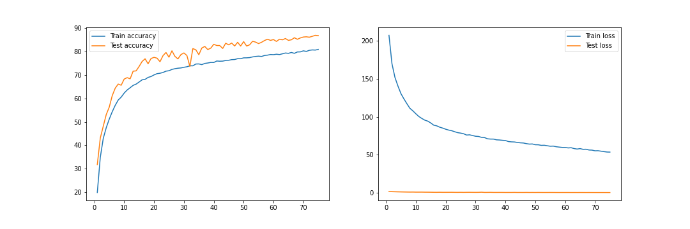
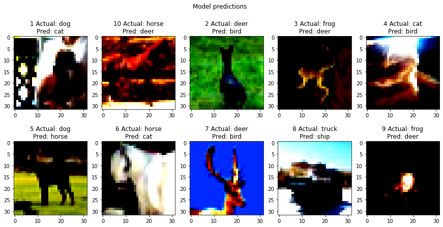

## Requirement
- Write an architecture C1C2C3C40 where each block consists of 3 conv layers
- Figure out how to use dilated kernels instead of MP or strided convolution
- One of the layers must use depthwise separable convolution
- One of the layers must use dilated convolution
- Use GAP
- Use albumentation library and apply below augmentation techniques:
  - HorizontalFlip
  - ShiftScaleRotate
  - CoarseDropout
- Achieve 85% test accuracy with no limits on epochs
- Total parameters to be less than 200K

## Code Walkthrough
- `S9.ipynb` is a notebook file that contains all experiments.
- `models` directory contains different model architectures that are experimented. All model architecture modules inherit `model_composite` class which contains common code for model training and evaluation.
- `utils` directory contain modules for fetching dataset, scheduler, applying data transformations, and utility code for visualizations etc.

## Experiment Results
#### TARGET:
  - Add depthwise convolution followed by 1x1 convolution
  - Add dilated conv instead of strided conv
  - Implement OneCycleLR policy
  - Achieve test accuracy of 85%

#### RESULT:
  - Parameters: 131,776
  - Best training accuracy: 80.9%
  - Best testing accuracy: 86.91%

#### ANALYSIS:
  - The test accuracy is improved and the ***target is achieved***
  - The model is under-fitting due to regularization

#### MODEL ARCHITECTURE:
[The final model code snippet](./models/model_5.py)

```
----------------------------------------------------------------
        Layer (type)               Output Shape         Param #
================================================================
            Conv2d-1           [-1, 32, 32, 32]             864
       BatchNorm2d-2           [-1, 32, 32, 32]              64
              ReLU-3           [-1, 32, 32, 32]               0
           Dropout-4           [-1, 32, 32, 32]               0
            Conv2d-5           [-1, 32, 32, 32]             288
       BatchNorm2d-6           [-1, 32, 32, 32]              64
              ReLU-7           [-1, 32, 32, 32]               0
           Dropout-8           [-1, 32, 32, 32]               0
            Conv2d-9           [-1, 32, 32, 32]           1,024
      BatchNorm2d-10           [-1, 32, 32, 32]              64
             ReLU-11           [-1, 32, 32, 32]               0
          Dropout-12           [-1, 32, 32, 32]               0
           Conv2d-13           [-1, 32, 15, 15]           9,216
      BatchNorm2d-14           [-1, 32, 15, 15]              64
             ReLU-15           [-1, 32, 15, 15]               0
          Dropout-16           [-1, 32, 15, 15]               0
           Conv2d-17           [-1, 32, 15, 15]             288
      BatchNorm2d-18           [-1, 32, 15, 15]              64
             ReLU-19           [-1, 32, 15, 15]               0
          Dropout-20           [-1, 32, 15, 15]               0
           Conv2d-21           [-1, 32, 15, 15]           1,024
      BatchNorm2d-22           [-1, 32, 15, 15]              64
             ReLU-23           [-1, 32, 15, 15]               0
          Dropout-24           [-1, 32, 15, 15]               0
           Conv2d-25           [-1, 32, 15, 15]             288
      BatchNorm2d-26           [-1, 32, 15, 15]              64
             ReLU-27           [-1, 32, 15, 15]               0
          Dropout-28           [-1, 32, 15, 15]               0
           Conv2d-29           [-1, 32, 15, 15]           1,024
      BatchNorm2d-30           [-1, 32, 15, 15]              64
             ReLU-31           [-1, 32, 15, 15]               0
          Dropout-32           [-1, 32, 15, 15]               0
           Conv2d-33           [-1, 32, 13, 13]           9,216
      BatchNorm2d-34           [-1, 32, 13, 13]              64
             ReLU-35           [-1, 32, 13, 13]               0
          Dropout-36           [-1, 32, 13, 13]               0
           Conv2d-37           [-1, 64, 13, 13]          18,432
      BatchNorm2d-38           [-1, 64, 13, 13]             128
             ReLU-39           [-1, 64, 13, 13]               0
          Dropout-40           [-1, 64, 13, 13]               0
           Conv2d-41           [-1, 64, 13, 13]             576
      BatchNorm2d-42           [-1, 64, 13, 13]             128
             ReLU-43           [-1, 64, 13, 13]               0
          Dropout-44           [-1, 64, 13, 13]               0
           Conv2d-45           [-1, 64, 13, 13]           4,096
      BatchNorm2d-46           [-1, 64, 13, 13]             128
             ReLU-47           [-1, 64, 13, 13]               0
          Dropout-48           [-1, 64, 13, 13]               0
           Conv2d-49             [-1, 64, 6, 6]          36,864
      BatchNorm2d-50             [-1, 64, 6, 6]             128
             ReLU-51             [-1, 64, 6, 6]               0
          Dropout-52             [-1, 64, 6, 6]               0
           Conv2d-53             [-1, 64, 6, 6]             576
      BatchNorm2d-54             [-1, 64, 6, 6]             128
             ReLU-55             [-1, 64, 6, 6]               0
          Dropout-56             [-1, 64, 6, 6]               0
           Conv2d-57             [-1, 64, 6, 6]           4,096
      BatchNorm2d-58             [-1, 64, 6, 6]             128
             ReLU-59             [-1, 64, 6, 6]               0
          Dropout-60             [-1, 64, 6, 6]               0
           Conv2d-61             [-1, 64, 6, 6]             576
      BatchNorm2d-62             [-1, 64, 6, 6]             128
             ReLU-63             [-1, 64, 6, 6]               0
          Dropout-64             [-1, 64, 6, 6]               0
           Conv2d-65             [-1, 64, 6, 6]           4,096
      BatchNorm2d-66             [-1, 64, 6, 6]             128
             ReLU-67             [-1, 64, 6, 6]               0
          Dropout-68             [-1, 64, 6, 6]               0
           Conv2d-69             [-1, 64, 4, 4]          36,864
      BatchNorm2d-70             [-1, 64, 4, 4]             128
             ReLU-71             [-1, 64, 4, 4]               0
          Dropout-72             [-1, 64, 4, 4]               0
           Conv2d-73             [-1, 10, 4, 4]             640
AdaptiveAvgPool2d-74             [-1, 10, 1, 1]               0
================================================================
Total params: 131,776
Trainable params: 131,776
Non-trainable params: 0
----------------------------------------------------------------
Input size (MB): 0.01
Forward/backward pass size (MB): 5.64
Params size (MB): 0.50
Estimated Total Size (MB): 6.15
----------------------------------------------------------------
```

#### VISUALIZATIONS:  
- Accuracy and loss plots  
The test accuracy is higher than the train accuracy because of the regularization techniques. The model is capable enough to learn and pass on the learnings across epochs.  

  

- Incorrect predictions
  